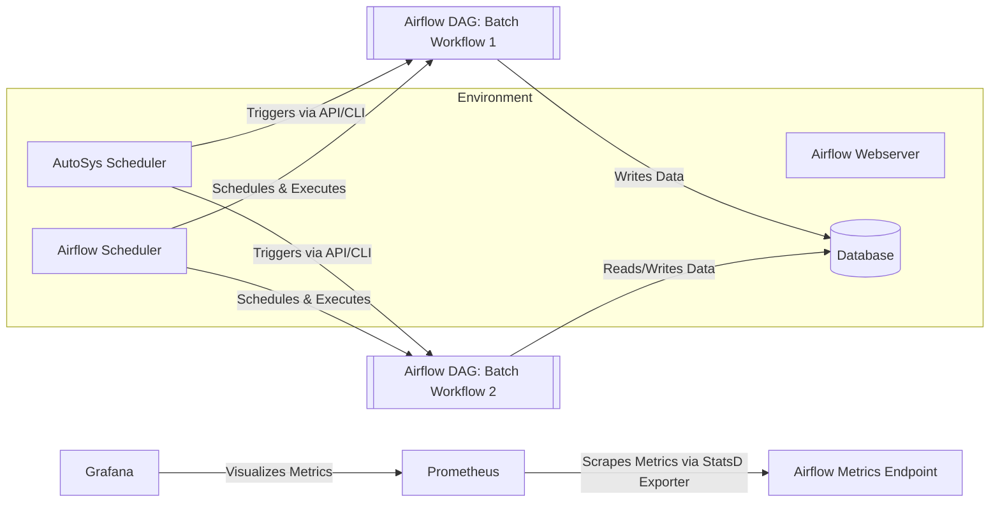

You can replace the SCDF-based approach with Apache Airflow by treating Airflow as the orchestrator, scheduler, and monitoring layer for your modernized batch jobs while you gradually retire AutoSys and shell scripts.[1][2][3]

## 1. Architecture Overview (Airflow)

- Current state remains the same: AutoSys triggers shell scripts that load staging/main tables, with multiple sources feeding the DB and downstream report generation.  
- Target state with Airflow:  
  - Phase 1: AutoSys continues to schedule, but calls Airflow-triggering entrypoints (REST API, CLI) instead of shell scripts for new/modernized jobs.[2]
  - Phase 2: Airflow becomes the primary scheduler; DAGs encapsulate the entire batch workflows (extract, transform, load, post-processing).[3][1]

Each workflow is modeled as a DAG (Directed Acyclic Graph) in Python, defining tasks and their dependencies, along with schedules (cron, presets, or timedelta).[4][5][1]

## 2. Airflow Orchestration, Monitoring, Error Handling

- Orchestration:  
  - Airflow’s **scheduler** parses DAGs, detects when dependencies are met, and enqueues tasks for execution via the configured executor.[6][2]
  - You define task steps (e.g., load staging, validate, load main, generate report) as Operators (PythonOperator, BashOperator, SQL operators, etc.).[7][3]

- Monitoring:  
  - Airflow Web UI shows DAG runs, task instance status, Gantt/graph views, and logs for each task.[5][1]
  - For Prometheus/Grafana, Airflow exposes metrics via StatsD/Prometheus exporter: Airflow components emit metrics to StatsD, a Prometheus StatsD exporter exposes those metrics for Prometheus to scrape, and Grafana visualizes them.[8][9][10]

- Error Handling & Retries:  
  - Each task supports retry policies (retries, retry_delay) and failure callbacks; DAG-level SLAs and alerts can be configured as well.[1][7]
  - Failed tasks can be manually re-run from the UI once issues are fixed, or you can implement automated recovery DAGs.[5][1]

## 3. Promotion Across Environments

- DAGs are plain Python files stored in Git; promotion is done via your CI/CD pipeline:  
  - CI builds and publishes any Docker images used by tasks (e.g., for heavy batch work).[3]
  - CD deploys Airflow to each environment (dev/stage/prod) and syncs the DAG repo/branch to the Airflow DAGs folder for that environment.[11][12][13]
- Environment-specific configuration is handled via:  
  - Airflow Variables and Connections (DB URLs, credentials, endpoints) per environment.[6]
  - Kubernetes/OpenShift ConfigMaps/Secrets for containerized tasks.[12][13][11]

This gives you consistent promotion semantics similar to exporting/importing SCDF task definitions, but driven by Git and CI/CD.

## 4. Deployment on OpenShift

- Airflow Components:  
  - Deploy Airflow **webserver**, **scheduler**, and **workers** (KubernetesExecutor or CeleryKubernetesExecutor) as OpenShift deployments.[13][11][12]
  - Use the official Airflow images or custom images aligning with your base images; configure via ConfigMaps and Secrets.[11][12][13]

- Configuration Highlights:  
  - DAGs volume (or Git-Sync) mounted into webserver and scheduler pods.[13][11]
  - ServiceAccount and RBAC aligned so Airflow can launch pods for tasks via KubernetesExecutor, respecting namespace and security policies.[12][13]
  - Metrics pipeline (Airflow → StatsD → Prometheus → Grafana) deployed alongside, as described earlier.[9][10][8]

Once running, Airflow becomes your central console to trigger, monitor, and troubleshoot batch workflows on OpenShift.[11][12]

## 5. Mermaid Diagram (Airflow Version)

You can update your Mermaid diagram like this:



This shows AutoSys initially triggering Airflow-based workflows while Airflow handles intra-pipeline orchestration, and Prometheus/Grafana monitoring the Airflow cluster.[2][8][9]

## 6. Sample Code Snippets (Airflow)

### Example Airflow DAG for a Batch Job

This replaces the Spring Batch job and SCDF task definition with an Airflow DAG and tasks:

```python
# dags/example_batch_dag.py
from datetime import datetime, timedelta
from airflow import DAG
from airflow.operators.python import PythonOperator
from airflow.operators.bash import BashOperator

default_args = {
    "owner": "data-eng",
    "retries": 3,
    "retry_delay": timedelta(minutes=5),
}

def extract():
    # read from source system, write to staging table
    pass

def transform():
    # apply transformations, validations
    pass

def load():
    # load into main tables
    pass

with DAG(
    dag_id="example_batch_workflow",
    start_date=datetime(2024, 1, 1),
    schedule="@daily",  # or cron expression
    catchup=False,
    default_args=default_args,
    max_active_runs=1,
) as dag:

    extract_task = PythonOperator(
        task_id="extract_to_staging",
        python_callable=extract,
    )

    transform_task = PythonOperator(
        task_id="transform_staging",
        python_callable=transform,
    )

    load_task = PythonOperator(
        task_id="load_main_tables",
        python_callable=load,
    )

    report_task = BashOperator(
        task_id="generate_reports",
        bash_command="python /opt/apps/generate_reports.py ",
    )

    extract_task >> transform_task >> load_task >> report_task
```

This uses standard Airflow DAG concepts: tasks, dependencies, scheduling, retries, and operators.[1][3][5]

### Triggering from AutoSys

In place of calling a shell script directly, AutoSys can call the Airflow CLI or REST API; for example, via a shell command in AutoSys:

```bash
airflow dags trigger -c '{"run_reason": "autosys"}' example_batch_workflow
```

Or invoke the Airflow REST endpoint (v2) from a script.[2]

### Prometheus Metrics for Airflow

Configure Airflow to emit StatsD metrics, then use a Prometheus StatsD exporter and Grafana:[8][9]

In `airflow.cfg` or environment variables:

```ini
[metrics]
statsd_on = True
statsd_host = statsd-exporter
statsd_port = 9125
statsd_prefix = airflow
```

Prometheus is configured to scrape the StatsD exporter’s HTTP endpoint, and Grafana uses Prometheus as the data source for Airflow dashboards.[10][9][8]

***

Would you like an additional example DAG that wraps an existing Spring Batch jar (e.g., running it inside a Kubernetes pod) so you can reuse existing jobs during migration?

Sources
[1] Dags — Airflow 3.1.8 Documentation https://airflow.apache.org/docs/apache-airflow/stable/core-concepts/dags.html
[2] Scheduler — Airflow 3.1.8 Documentation https://airflow.apache.org/docs/apache-airflow/stable/administration-and-deployment/scheduler.html
[3] Batch vs Stream Processing in Apache Airflow Explained https://moldstud.com/articles/p-batch-vs-stream-processing-in-apache-airflow-explained
[4] Schedule DAGs in Apache Airflow® | Astronomer Documentation https://www.astronomer.io/docs/learn/scheduling-in-airflow
[5] DAGs — Airflow Documentation https://airflow.apache.org/docs/apache-airflow/2.6.0/concepts/dags.html
[6] Apache Airflow Concepts with DAG Scheduling and Variables https://www.qubole.com/blog/apache-airflow-concepts-dag-scheduling-and-variables
[7] Scheduling Data Pipelines with Apache Airflow: A Beginner's Guide https://www.dasca.org/world-of-data-science/article/scheduling-data-pipelines-with-apache-airflow-a-beginners-guide
[8] Monitoring Airflow with Prometheus, StatsD, and Grafana - Tracer https://www.tracer.cloud/resources/monitoring-airflow-prometheus-statsd-grafana
[9] Monitoring Apache Airflow using Prometheus - Red Hat https://www.redhat.com/en/blog/monitoring-apache-airflow-using-prometheus
[10] Apache Airflow monitoring made easy | Grafana Labs https://grafana.com/integrations/apache-airflow/monitor/
[11] AirFlow Openshift Cluster Boilerplate - OpenDevStack https://www.opendevstack.org/ods-documentation/opendevstack/2.x/quickstarters/airflow-cluster.html
[12] The Simplest Way to Make Airflow OpenShift Work Like It Should https://hoop.dev/blog/the-simplest-way-to-make-airflow-openshift-work-like-it-should/
[13] Run Apache Airflow on OpenShift - GitHub https://github.com/CSCfi/airflow-openshift
[14] Architecture - Documentation | Spring Cloud Data Flow https://dataflow.spring.io/docs/concepts/architecture/
[15] What is Apache Airflow? For beginners - YouTube https://www.youtube.com/watch?v=CGxxVj13sOs
